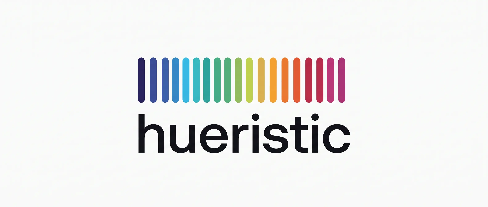
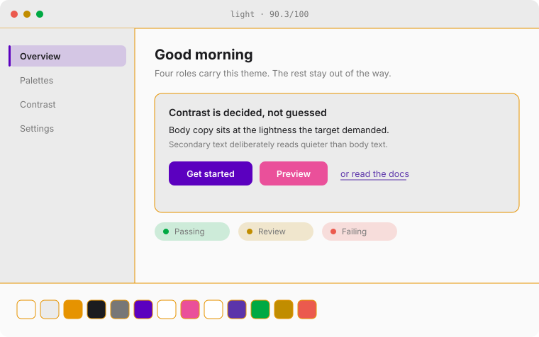
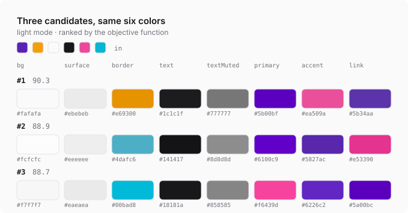
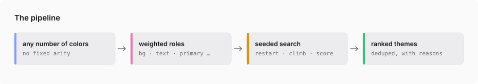
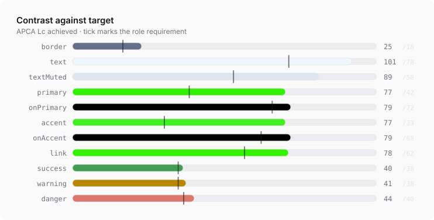
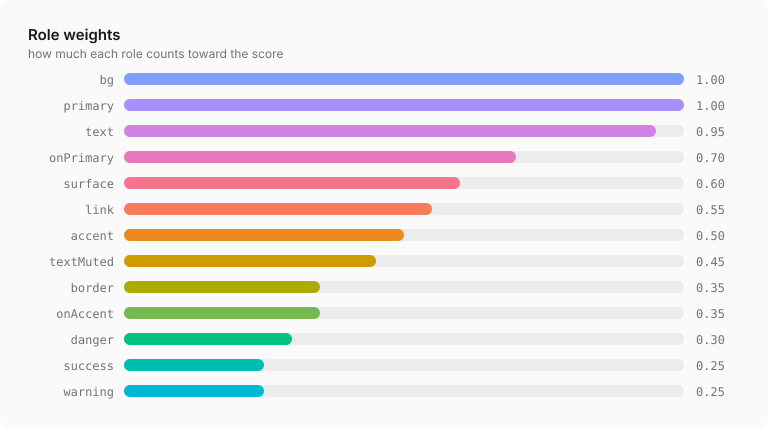

<picture>
  <source media="(prefers-color-scheme: dark)" srcset="assets/banner-dark.webp">
  
</picture>

<p align="center">
  <b>Hand it colors. Get themes back — ranked, readable, and explained.</b><br>
  <sub>Weighted role assignment over any number of input colors · APCA · OKLCh · zero dependencies</sub>
</p>

---

Every other palette tool takes **one** color and expands it into a scale. Real
briefs are not one color. They are *"here's our brand purple, the logo orange,
the grey from the old site, and this green the CEO likes"* — and the question
isn't what shades exist. It's **which color should be the background, which
should be the button, what has to change to make that readable, and can I see a
few options.**

That is an assignment-and-search problem. This solves it.

```bash
git clone https://github.com/daxaur/hueristic && cd hueristic
node bin/hueristic.js '#5b21b6' '#f59e0b' '#fafafa' '#18181b' -f preview > theme.svg
```

<picture>
  <source media="(prefers-color-scheme: dark)" srcset="assets/preview-dark.svg">
  
</picture>

## Contents

- [Quick start](#quick-start) · [What you get back](#what-you-get-back) · [Previews](#previews)
- [How it works](#how-it-works) · [Weights](#weights) · [API](#api) · [For agents](#for-agents)

## Quick start

```bash
node bin/hueristic.js '#0f172a' '#34f003' '#e2e8f0'
```

```
  Theme 1/1  92.9/100
  harmony 95  coherence 100

  ███ bg         #0e182e          was #0f172a
  ███ surface    #1b2438          was #0f172a
  ███ border     #59647d  Lc  19   was #0f172a
  ███ text       #e4eaf3  Lc  93   was #e2e8f0
  ███ textMuted  #c9cfd7  Lc  76   was #e2e8f0
  ███ primary    #42ee25  Lc  77   was #34f003
  ███ onPrimary  #000000  Lc  79
  ███ accent     #33ef00  Lc  77   was #34f003
  ███ link       #32eb00  Lc  75   was #34f003

  changes
    border: lightness +30% — Lc 0 on surface, needs 18 — now 19
    textMuted: lightness -8% — Lc 91 on bg, needs 58 — now 76
```

Any number of colors, in any order. Role assignment is the algorithm's job — use
weights, not argument order, to say which color matters.

| flag | |
|---|---|
| `-m, --mode dark\|light\|both` | which mode to solve for |
| `-n, --count <n>` | how many candidates to return |
| `-s, --seed <n>` | same seed, same themes |
| `-w, --weight <role=value>` | override a role weight, repeatable |
| `-f, --format <fmt>` | `table` `json` `css` `tailwind` `tokens` `preview` |
| `--preview-dir <dir>` | write an SVG mock-up per candidate |
| `--effort fast\|normal\|deep` | search budget |
| `--evaluate <json\|file>` | score a theme you already have |

## What you get back

Ask for more than one and you get genuinely different answers — deduplicated by
role assignment *and* by perceptual distance, not the same theme nudged:

<picture>
  <source media="(prefers-color-scheme: dark)" srcset="assets/palettes-dark.svg">
  
</picture>

Every color reports what changed and which requirement forced it. When a role
falls short, it checks whether a color you supplied but the solver passed over
would have cleared the bar, and names it:

```
· inline links: Lc 59, short of 62. #5b21b6 clears it on bg untouched —
  that color belongs in this role. Weight link up to force it.
· #f59e0b did not earn a role — no slot suited it better than the colors that won.
```

## Previews

Any theme renders to a mock interface as plain SVG — no image model, no canvas,
no dependency. Useful when something needs to *show* a palette rather than list
hex codes.

```bash
hueristic '#0f172a' '#34f003' -f preview > theme.svg     # one, to stdout
hueristic '#0f172a' '#34f003' -n 3 --preview-dir ./out    # one file per candidate
```

```js
import { generateThemes, renderPreview } from 'hueristic';

const { themes } = generateThemes(['#0f172a', '#34f003'], { mode: 'dark' });
const svg = renderPreview(themes[0].palette, { title: 'dark · 92.9' });
```

Deterministic, self-contained, and about 6 kB — safe to write to a file, inline
in a page, or convert to PNG.

## How it works

<picture>
  <source media="(prefers-color-scheme: dark)" srcset="assets/pipeline-dark.svg">
  
</picture>

**1 · OKLCh.** Perceptually uniform, so a lightness step means the same thing at
every hue and chroma stays independent of it. The spectrum in the banner is a
plain hue sweep at one fixed lightness and chroma — evenly spaced by
construction, which the same sweep in HSL is not.

**2 · Roles declare what they need.** What they sit on, the contrast they
require, whether they must carry chroma, whether they are supposed to recede.

**3 · Contrast is APCA.** WCAG 2.1's ratio badly mispredicts perceived contrast
on dark backgrounds, which is exactly where themes live now. The solver
optimises `Lc`; WCAG ratios are reported alongside for compliance.

<picture>
  <source media="(prefers-color-scheme: dark)" srcset="assets/contrast-dark.svg">
  
</picture>

**4 · A theme is three numbers per role** — which input color it draws from, how
far past its contrast target to push, and how much of the source chroma to keep.
Building a theme from those is deterministic: solve roles in dependency order,
bisecting lightness against the already-fixed background until the target `Lc`
is met. **Hue never rotates**, so your colors stay your colors.

**5 · Score, then search.** A weighted sum of per-role fitness — contrast
against target, fidelity to the color you supplied, chroma appropriate to the
job — plus hue harmony, chroma coherence and palette coverage, minus penalties
for flat hierarchy and gamut damage.

Some constraints *gate* the score rather than nudging it. A colorless primary, a
border as loud as body text, a caption in the brand purple: these are not
slightly worse, they are the wrong answer. Weight-and-add alone produced grey
buttons and near-white borders scoring 92/100.

Then it hill-climbs that parameter vector from many seeded random starts.

## Weights

Weight is how much a role matters. It makes the solver work harder to satisfy
that role *and* hold closer to the color it was given.

<picture>
  <source media="(prefers-color-scheme: dark)" srcset="assets/weights-dark.svg">
  
</picture>

If someone is precious about one color, weight its role up and let the rest move
around it:

```bash
hueristic '#fafafa' '#111111' '#e11d48' --weight primary=2 --mode light
```

## API

```js
import { generateThemes, evaluateTheme, renderPreview } from 'hueristic';

const { themes } = generateThemes(['#0f172a', '#34f003', '#e2e8f0'], {
  mode: 'dark',        // or 'light'
  count: 5,
  seed: 1,             // same seed, same themes
  weights: { primary: 1.6, textMuted: 0.2 },
});

themes[0].palette;         // { bg: '#0e182e', primary: '#42ee25', … }
themes[0].critique.notes;  // what to change, in words
```

`evaluateTheme` runs the same objective over a theme you already have, without
changing it:

```js
evaluateTheme({ bg: '#111827', text: '#6b7280', primary: '#374151' }, { mode: 'dark' });
// { score: 61.3, critique: { notes: ['secondary text is as loud as body text', …] } }
```

The primitives are exported too: `apca`, `wcagRatio`, `hexToOklch`, `oklchToHex`.

## For agents

`SKILL.md` is written for coding agents — when to reach for it, how to read the
JSON, and how to turn the critique into advice. Drop the repo into a skills
directory and it works as-is. `-f json` carries the full report; `-f preview`
gives you something to show.

## Install

No npm publish, no build step, no dependencies. Node 18+.

```bash
git clone https://github.com/daxaur/hueristic          # clone
npm install github:daxaur/hueristic                    # or as a dependency
```

## Tests

```bash
npm test        # 35 tests
npm run assets  # rebuild every figure in this readme from live solver output
```

The APCA implementation is checked against its published reference values
(`Lc 106.04` black on white, `-107.88` white on black, `63.06` for `#888` on
white). If a change moves those, the change is wrong.

Every figure above is generated by `npm run assets`, and every color in them is
mixed by the library itself — so they cannot drift from what the code does.

## Prior art

Standing on Björn Ottosson's [OKLab](https://bottosson.github.io/posts/oklab/),
Andrew Somers' [APCA](https://github.com/Myndex/SAPC-APCA), and the
contrast-first thinking in [Leonardo](https://github.com/adobe/leonardo),
[Radix Colors](https://www.radix-ui.com/colors) and Huetone. What's new here is
treating the whole thing as weighted assignment and search over an arbitrary set
of colors, and returning the reasoning.

MIT
